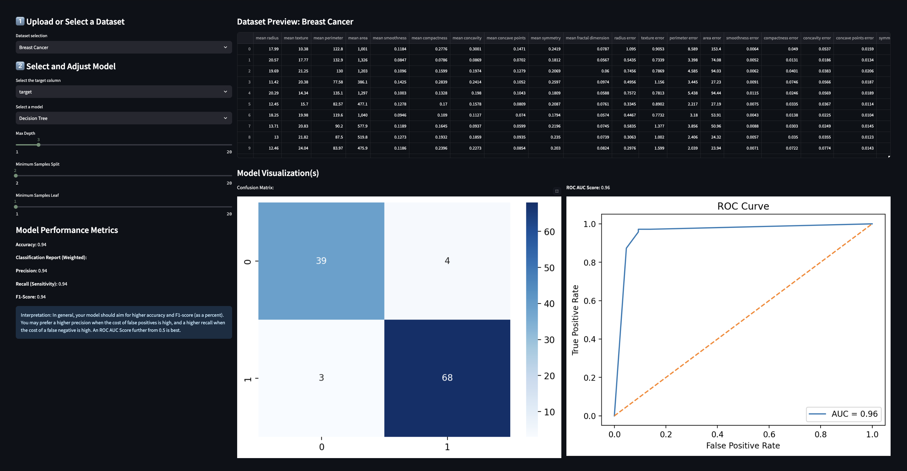

# Machine Learning Streamlit Application

This ***Machine Learning Streamlit Application*** allows users to select and train supervised machine learning models using a sample dataset or their own uploaded .csv file. Users can preview their dataset, experiment with hyperparameters, and view changes to their model performance metrics as they tune.  

This app includes the following machine learning models:
* Linear Regression
* Logistic Regression
* K-Nearest Neighbors
* Decision Tree

My end objective is to give users the ability to quickly train machine learning models suitable for their various needs, all without having to write their own code.

## Table of contents
- [Installation](#installation)
- [Usage](#usage)
- [Data](#data)
- [License](#license)
- [References](#references)
- [Screenshots](#screenshots)
  
## **Installation**

**Requirements:**  
This project is available on the Streamlit Community Cloud at [cozettebrown-machine-learning-app.streamlit.io](cozettebrown-machine-learning-app.streamlit.io)

To install **MLStreamlitApp**, follow these steps:
1. Clone the repository: **`git clone https://github.com/cozette-brown/BROWN-Data-Science-Portfolio/MLStreamlitApp.git`**
2. Navigate to the project directory: **`cd MLStreamlitApp`**
3. Install dependencies: **`pip install -r requirements.txt`**
4. Run the project: **`streamlit run main.py`**

## **Usage**

To use **MLStreamlitApp**, follow these steps:

1. **Run the Streamlit App:** Navigate to the MLStreamlitApp directory and run the project with **`streamlit run main.py`
2. **Upload or Select a Dataset** Select a sample dataset from sklearn.datasets or upload your own .csv file *(NOTE: At this time, the application only supports files which are already prepared for machine learning models. Please tidy and preprocess data before uploading.)*
3. **Select a Target Variable:** For sample datasets, there are already set 'target' variables, but in some cases you can choose a different variable.
4. **Select a Machine Learning Model:** Choose from Linear Regression, Logistic Regression, K-Nearest Neighbors, or Decision Tree. The application will warn you if the selected model is not appropriate for your selected sample dataset.
5. **Adjust Hyperparameters:** Adjust C for Logistic Regression; Number of Neighbors for K-Nearest Neighbors; and Max Depth, Minimum Samples Split, and Minimum Samples Leaf for Decision Tree.
6. **View Model Performance Metrics:** Analyze MSE, RMSE, and R² Score for Linear Regression, or analyze Accuracy, Precision, Recall (Sensitivity), and F1-Score for other machine learning models. Each metric summary comes with a short guide to interpreting the results.

## Data

This project uses the following sample datasets from sklearn.datasets:
* Diabetes (regression)
* Breast Cancer Wisconsin (classification)
* Iris (classification)
* Wine (classification)

Learn more about the datasets [here](https://scikit-learn.org/stable/api/sklearn.datasets.html) on the Scikit Learn API Reference.

## License

This project is part of a portfolio released under the MIT License. See the portfolio license file **[here](https://github.com/cozette-brown/BROWN-Data-Science-Portfolio/blob/d7c128186047d453de9f2491894e4fd0fa3da77d/LICENSE.md)** for details.

## References

I created this project with help from the following sources:
* Lectures and .ipynb files from Professor David Smiley, University of Notre Dame
* Leung, K. (2023). "Micro, Macro & Weighted Averaged of F1 Score, Clearly Explained."
* [Scikit-learn LabelEncoder documentation](https://scikit-learn.org/stable/modules/generated/sklearn.preprocessing.LabelEncoder.html)
* [Scikit-learn LinearRegression Documentation](https://scikit-learn.org/stable/modules/generated/sklearn.linear_model.LogisticRegression.html)
* Serrano, L.G. (2021). *Grokking Machine Learning,* Manning Publications Co.

Plus assistance from these other resources I recommend:
* [Geeks for Geeks](https://geeksforgeeks.org)
* [W3 Schools](https://www.w3schools.com)
* [Streamlit Emoji Shortcodes](https://streamlit-emoji-shortcodes-streamlit-app-gwckff.streamlit.app/)

## Screenshots

